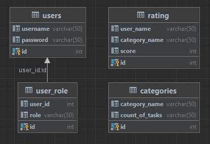

# Веб приложение для отслеживания прогресса сотрудников 

Веб приложение разработано на языке Go с помощью
"html/template" "log" "net/http" "database/sql"

База данных, задействованная в реализации веб приложения - MySQL

Доступно разграничение по ролям

Внутри системы есть три пользователя:

* Billy Herrington (Admin)
* Tyler Derden (User)
* Mickey Pirson (User)

Так же в базе изначально есть три категории, а у пользователей есть
результаты по этим категориям из которых строится рейтинг

Схема базы данных
